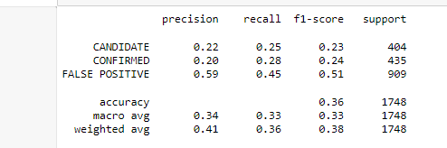

# machine-learning-challenge
create machine learning models capable of classifying
# Machine Learning - Exoplanet Exploration

## Background

Over a period of nine years in deep space, the NASA Kepler space telescope has been out on a planet-hunting mission to discover hidden planets outside of our solar system.

To help process this data, you will create machine learning models capable of classifying candidate exoplanets from the raw dataset.

Completed:

1. [Preprocess the raw data](#Preprocessing)
2. [Tune the models](#Tune-Model-Parameters)
3. [Compare two or more models](#Evaluate-Model-Performance)

- - -

## Instructions

### Preprocess the Data

* Preprocess the dataset prior to fitting the model.
* Perform feature selection and remove unnecessary features.
* Use `MinMaxScaler` to scale the numerical data.
* Separate the data into training and testing data.

### Tune Model Parameters

* Use `GridSearch` to tune model parameters.
* Tune and compare at least two different classifiers.

## Resources

* [Exoplanet Data Source](https://www.kaggle.com/nasa/kepler-exoplanet-search-results)

* [Scikit-Learn Tutorial Part 1](https://www.youtube.com/watch?v=4PXAztQtoTg)

* [Scikit-Learn Tutorial Part 2](https://www.youtube.com/watch?v=gK43gtGh49o&t=5858s)

* [Grid Search](https://scikit-learn.org/stable/modules/grid_search.html)

### Reporting
* Create a README that reports a comparison of each model's performance as well as a summary about your findings and any assumptions you can make based on your model (is your model good enough to predict new exoplanets? Why or why not? What would make your model be better at predicting new exoplanets?).

## REPORT

### Analysis

For Model-1 
* The first step after reading the datawas decide which features to keep for the model. 

* I removed  featureswith values are mostly 0's. Removing them increases the accuracy of the model, but that unfortunately that wasn't the case. Also removing columns for all features didn't improve the accuracy but, decreased the accuracy dramatically.

* The next step was assigning X and y values for the model to perform split data to get train and test data for the model.
 Changing to StandardScaler to scale the data resulted better numbers for the scores, Training Data Score: 0.8371161548731643 ,Testing Data Score: 0.8564073226544623.

* I then used GridSearchCV to tune the model's parameters and changing the grid parameters C and gamma did get a score improvement.

404 itemes were candidates to be  a planet, with 435 confirmed and 909 as a false positive.

 # Results of Weighted avg 
 Precision 0.41        Recall 0.36    F1-score: 0.38   Support: 1748

In this model I was able to predict the following scores.

Training Data Score: 0.8371161548731643
Testing Data Score: 0.8564073226544623

I found better results with Hyperparameter Tuning, with a result of 87% accuracy.
I believe results could improve if we have more Properties columns available.With research we could incorporate "Ensemble Methods" like bagging or boosting.

- - -
